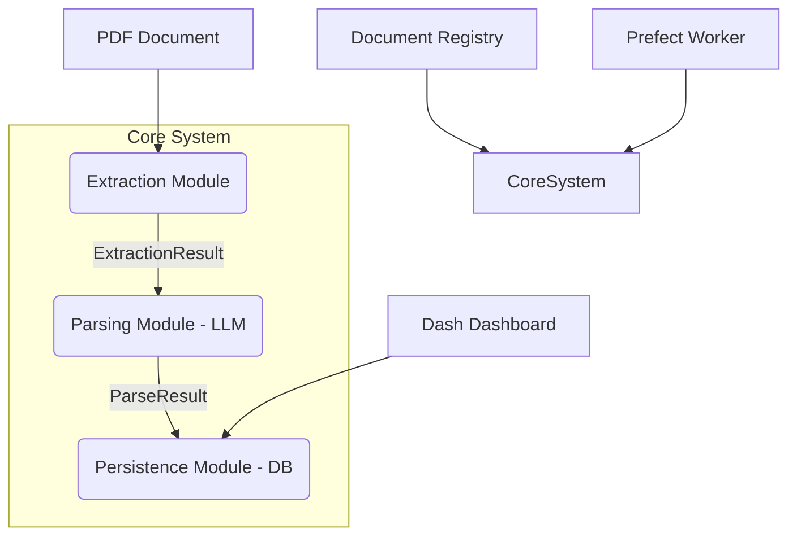

# PDF Parsing Pipeline

A scalable, production-ready pipeline for extracting and structuring data from PDFs using Docling/Tesseract and LLMs, built with Python 3.11+, SQLModel, and Prefect.

## Architecture



## Quick Start

1. **Install dependencies:**
   ```bash
   pip install -e .
   ```
2. **Configure environment:**
   Copy `.env.example` to `.env` and adjust variables.
3. **Initialize the database:**
   ```bash
   alembic upgrade head
   ```
4. **Run a PDF extraction:**
   ```bash
   python -m pdf_parsing.cli process /path/to/invoice.pdf --type example_invoice
   ```

## Usage

### CLI Commands
- `python -m pdf_parsing.cli process <file> --type <doc_type>`: Process a PDF.
- `python -m pdf_parsing.cli init-db`: Initialize the database.
- `python -m pdf_parsing.cli serve`: Start the dashboard.

## Docker Deployment

To deploy using Docker Compose:
```bash
docker-compose up -d
```
This will start PostgreSQL, the Dash application, and Prefect components.

## Adding a New Document Type

To add a new document type (e.g., `receipt`), follow these steps:
1. Create a directory `src/pdf_parsing/document_types/receipt`.
2. Add `__init__.py` exposing the config.
3. Add `models.py` defining the SQLModel classes.
4. Add `config.py` defining the `DocumentConfig` instance.
5. Generate an Alembic migration to create the tables.

## Project Structure
```
src/
└── pdf_parsing/
    ├── cli/
    ├── config.py
    ├── core/
    ├── dashboard/
    ├── db/
    ├── document_types/
    ├── extraction/
    ├── parsing/
    ├── persistence/
    ├── pipeline/
    └── registry.py
tests/
└── unit/
```

## License
MIT License
