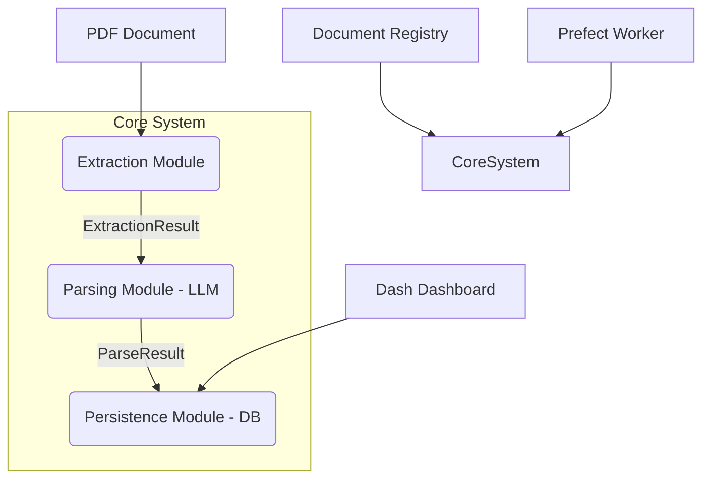

# PDF Parsing Pipeline

A scalable, production-ready pipeline for extracting and structuring data from PDFs using Docling/Tesseract and LLMs (Gemini, OpenAI, Anthropic), built with Python 3.11+, SQLModel, and Prefect.

## Architecture



## Quick Start

1. **Install dependencies:**
   ```bash
   pip install -e .
   ```
2. **Configure environment:**
   Copy `.env.example` to `.env` and adjust variables, specifically your API key:
   ```bash
   cp .env.example .env
   # Edit .env and set PDF_PARSING_GEMINI_API_KEY
   ```
3. **Initialize the database:**
   ```bash
   pdf-parsing init-db
   ```
4. **Run a PDF extraction:**
   ```bash
   pdf-parsing run example_invoice /path/to/invoice.pdf
   ```

## Usage

### CLI Commands
- `pdf-parsing list-types`: List all registered document types.
- `pdf-parsing new-type <doc_type>`: Scaffold a new document type from the cookiecutter template.
- `pdf-parsing run <doc_type> <file>`: Process a single PDF document.
- `pdf-parsing init-db`: Initialize the local database tables based on registered SQLModels.

## Local Deployment & Dashboards

This project does not rely on Docker. You can run all processes locally in your terminal.

**1. Run the Prefect Server (for monitoring pipelines)**
```bash
prefect server start
```
*Navigate to http://localhost:4200 to view your orchestration dashboard.*

**2. Run the Human-in-the-Loop Validation Dashboard**
```bash
python -m pdf_parsing.dashboard.app
```
*Navigate to http://localhost:8050 to view the Dash app, where you can tune prompts and validate extractions.*

## Adding a New Document Type

Adding a new document type is entirely plug-and-play without touching core framework code.

1. **Scaffold the type:**
   ```bash
   pdf-parsing new-type my_new_document
   ```
2. **Edit the models:** Open `src/pdf_parsing/document_types/my_new_document/models.py` and define your SQLModel classes.
3. **Edit the prompts:** Open `prompts.py` and write your extraction instructions.
4. **Initialize DB:** Run `pdf-parsing init-db` to create the new tables.
5. **Run it:** Run a PDF against your new type to extract data directly to the database.

## License
MIT License
